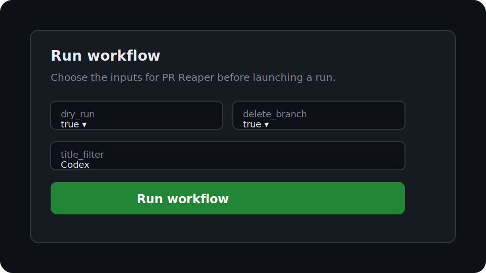

# PR Reaper

[![CI][badge-ci]][actions-ci]
[![Close my open PRs][badge-close-prs]][actions-close-prs]
[![License: MIT][badge-license]][license]

One-button workflow to close all open pull requests authored by you. Designed for sweeping away
orphaned or superseded PRs (e.g., from automated Codex runs) in bulk, with a safe dry-run mode
before reaping begins. `gh search prs` powers the lookup so results match what GitHub shows.



## Quick start

1. Provision `PR_REAPER_TOKEN` – a Personal Access Token (classic) with `repo` and `read:org`
   scopes – and add it as an Actions secret. The workflow will fall back to `GITHUB_TOKEN`, but
   cross-repo searches are then limited to the current repository.
2. Go to **Actions → Close my open PRs → Run workflow**.
3. Leave **dry_run=true** to preview. The run uploads a `dry-run-prs` artifact with a Markdown
   summary, CSV export, and machine-readable `prs.json` file listing the PRs that would be closed.
4. When happy, re-run with **dry_run=false** to close the PRs (and optionally delete their branches).

## Inputs and outputs

| Input | Type | Default | Example | Notes |
| --- | --- | --- | --- | --- |
| `dry_run` | boolean | `true` | `false` | When `true`, the action only gathers results and uploads artifacts. |
| `author` | string | `""` | `octocat` | Defaults to `github.actor` when blank. |
| `org` | string | `""` | `democratizedspace` | Requires `read:org` scope on the token. |
| `title_filter` | string | `""` | `Codex` | Passed to `gh search prs --search ... --match title`. |
| `delete_branch` | boolean | `true` | `false` | Controls whether the PR source branch is deleted after closing. |
| `limit` | string | `"1000"` | `250` | Valid range: `1`–`1000`. |
| `comment` | string | `"Closing as superseded by a newer Codex run."` | `"Thanks for iterating!"` | Comment posted while closing PRs. |
| `exclude_urls` | string | `""` | `https://github.com/octo/repo/pull/42` | Accepts newline, comma, pipe, or semicolon separators. Supports `owner/repo#123`, HTML, and API URLs. |

**Outputs**

- `count`: number of pull requests matched after filtering exclusions.
- Dry-run uploads: `dry-run-prs/prs.json`, `dry-run-prs/summary.md`, and `dry-run-prs/prs.csv` for
  human and machine review.

## Safety model

- Dry runs never close PRs or delete branches. They only log matches, write `prs.json`, and upload
  the dry-run artifacts.
- Authenticated runs are required for mutations. If `gh` cannot detect an authenticated identity or
  the token lacks `repo` scope, the action fails before searching.
- Providing `org` requires `read:org`. The action exits early with a descriptive error when the
  scope is missing and emits a warning when scope detection is inconclusive.
- Exclusion filters accept HTML/API URLs and shorthand `owner/repo#number` references to ensure safe
  skips even when links are copied from different contexts.

## Auth (important)

This workflow uses the GitHub CLI (`gh`). In Actions, `gh` will authenticate as:

- `GH_TOKEN` if set (recommended) — provide a **Personal Access Token (classic)** with `repo` and
  `read:org`, saved as `PR_REAPER_TOKEN`, exported as `GH_TOKEN` in the job. The workflow fails if
  `repo` scope is missing and warns when `read:org` is absent.
- Otherwise, it may fall back to `GITHUB_TOKEN` or be unauthenticated. `GITHUB_TOKEN` is only scoped
  to the current repo, so cross-repo searches will return nothing.
- If `GH_TOKEN` is missing but `PR_REAPER_TOKEN` is present, the action now forwards it to `gh` as a
  fallback.

If you provide the `org` input, the token must include `read:org` scope or the workflow will exit
with an error.

Tip: The action prints `gh --version`, `gh auth status`, the authenticated login, and detected token
scopes so you can verify which identity `gh` is using.

## Development

Run the checks locally:

```bash
npm run lint
npm run test:ci
```

CI runs these commands on every push.

## License

Licensed under the [MIT License](LICENSE).

[badge-ci]: https://github.com/futuroptimist/pr-reaper/actions/workflows/ci.yml/badge.svg
[actions-ci]: https://github.com/futuroptimist/pr-reaper/actions/workflows/ci.yml
[badge-close-prs]: https://github.com/futuroptimist/pr-reaper/actions/workflows/close-my-open-prs.yml/badge.svg
[actions-close-prs]: https://github.com/futuroptimist/pr-reaper/actions/workflows/close-my-open-prs.yml
[badge-license]: https://img.shields.io/badge/license-MIT-blue.svg
[license]: #license
